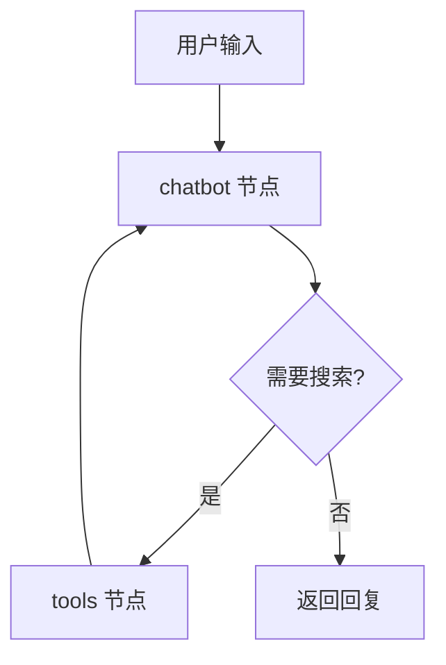

# AIDD Agent 聊天机器人

基于 LangGraph 和阿里云通义千问构建的AIDD Agent聊天机器人，支持 Tavily 搜索引擎实时查询。

## ✨ 功能特点

- 🤖 **通义千问对话** - 使用阿里云百炼的 qwen-max 模型
- 🔍 **Tavily 搜索** - 自动判断是否需要联网搜索最新信息
- 💬 **多轮对话** - 支持上下文记忆的连续对话
- 📊 **图结构可视化** - 自动生成 Mermaid 和 PNG 格式的流程图
- 🔄 **流程追踪** - 可视化展示每一步的执行流向

## 📁 项目结构

```
langchain-test2/
├── main.py                    # 主入口
├── .env                       # 环境变量配置
├── README.md
├── src/
│   ├── __init__.py
│   ├── chat.py               # 交互式聊天功能
│   │
│   ├── config/               # 配置模块
│   │   ├── __init__.py
│   │   └── settings.py       # 配置管理
│   │
│   ├── models/               # 模型模块
│   │   ├── __init__.py
│   │   └── llm.py            # LLM 初始化
│   │
│   ├── tools/                # 工具模块
│   │   ├── __init__.py
│   │   ├── search.py         # Tavily 搜索工具
│   │   └── registry.py       # 工具注册中心
│   │
│   ├── graph/                # LangGraph 模块
│   │   ├── __init__.py
│   │   ├── state.py          # 状态定义
│   │   ├── nodes.py          # 节点函数
│   │   └── builder.py        # 图构建
│   │
│   └── utils/                # 工具函数
│       ├── __init__.py
│       └── visualization.py  # 可视化功能
│
└── chat_graph.mmd            # 生成的流程图
```

## 🚀 快速开始

### 1. 安装依赖

```bash
# 使用 mamba/conda
mamba install -c conda-forge langchain-core langgraph langchain-community langchain-tavily python-dotenv dashscope

# 或使用 pip
pip install langchain-core langgraph langchain-community langchain-tavily python-dotenv dashscope
```

### 2. 配置环境变量

在项目根目录创建 `.env` 文件：

```env
# 阿里云百炼 API Key
DASHSCOPE_API_KEY=sk-your-api-key

# Tavily 搜索 API Key (从 https://tavily.com 获取)
TAVILY_API_KEY=tvly-your-api-key
```

### 3. 运行

```bash
python main.py
```

## 💻 使用方法

启动后进入交互模式：

```
聊天机器人已启动，输入消息并按回车发送。
特殊命令: exit/quit=退出, flow=切换流向显示, clear=清空历史

💡 提示：机器人现在可以使用 Tavily 搜索引擎查找最新信息！

👤 User: 今天上海天气如何

🤖 Assistant: 今天上海的天气情况如下：
- 天气：多云转晴
- 温度范围：7℃～14℃
- 风向与风力：偏北风，风力4-5级
```

### 特殊命令

| 命令 | 说明 |
|------|------|
| `exit` / `quit` | 退出程序 |
| `flow` | 切换流程追踪显示 |
| `clear` | 清空对话历史 |

### 流程追踪模式

输入 `flow` 开启后，可以看到详细的执行流程：

```
👤 User: 2024年诺贝尔物理学奖得主是谁

🔄 执行流向:
  步骤 1: [💭 chatbot] 正在思考...
  步骤 2: [🔧 tools] 正在调用搜索工具...
  步骤 3: [💭 chatbot] 正在思考...

🤖 Assistant: 2024年诺贝尔物理学奖授予了...
```

## 🔧 扩展开发

### 添加新工具

1. 在 `src/tools/` 目录下创建新文件，如 `calculator.py`：

```python
from langchain_core.tools import tool

@tool
def calculator(expression: str) -> str:
    """计算数学表达式。"""
    return str(eval(expression))
```

2. 在 `src/tools/registry.py` 中注册：

```python
from .calculator import calculator

def create_tools():
    tools = [
        create_search_tool(),
        calculator,  # 添加新工具
    ]
    return tools
```

### 切换模型

修改 `src/config/settings.py` 中的配置：

```python
model_name: str = "qwen-plus"  # 或其他模型
temperature: float = 0.5
```

## 📊 架构图



## 📝 API Keys 获取

- **DashScope API Key**: [阿里云百炼控制台](https://dashscope.console.aliyun.com/)
- **Tavily API Key**: [Tavily 官网](https://tavily.com/)

## 📄 License

MIT License
